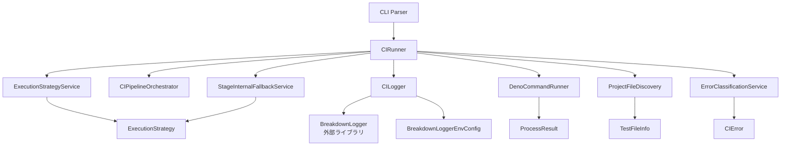

# Deno Local CI - クラス設計

## 概要

Deno Local CIは、GitHubActionsと同等のCI環境をローカルで実現するツールです。
本設計書は、要求事項(docs/requirements.md)と開発原則(docs/development/*)に基づき、
ドメイン駆動設計(DDD)と型安全性原則(Totality)に従ったクラス設計を定義します。

## アーキテクチャ原則

### 1. ドメイン駆動設計(DDD)レイヤー

```
┌─────────────────────────────────────────────────────────────┐
│                      Presentation Layer                      │
│                     (CLI, Configuration)                     │
├─────────────────────────────────────────────────────────────┤
│                     Application Layer                        │
│                  (Orchestration, Workflow)                   │
├─────────────────────────────────────────────────────────────┤
│                        Domain Layer                          │
│            (Business Logic, Rules, Value Objects)           │
├─────────────────────────────────────────────────────────────┤
│                    Infrastructure Layer                      │
│              (File System, Process Execution)                │
└─────────────────────────────────────────────────────────────┘
```

### 2. 型安全性原則 (Totality Principles)

- **Result型によるエラー値化**: 例外を使用せずResult<T, E>型でエラーを表現
- **Discriminated Union**: 状態をタグ付きユニオンで網羅的に表現
- **Smart Constructor**: privateコンストラクタとstatic createメソッドで検証付き生成
- **ハードコーディング禁止**: 設定値は外部化し、コンフィグレーション管理

## コアドメインモデル

### 1. 実行戦略 (ExecutionStrategy)

```typescript
class ExecutionStrategy {
  private constructor(
    readonly mode: ExecutionMode,
    readonly fallbackEnabled: boolean,
    readonly hierarchy: string | null
  );

  static create(
    mode: ExecutionMode,
    fallbackEnabled: boolean,
    hierarchy: string | null
  ): Result<ExecutionStrategy, ValidationError>;

  getNextFallbackMode(): ExecutionMode | null;
  getCommandArgs(baseCommand: string[]): string[];
  shouldSkipJSRCheck(): boolean;
}
```

**責務**:
- CI実行モード(All/Batch/Single-file)の管理
- フォールバック戦略の決定
- 階層指定時のコマンド引数生成

### 2. CIステージ (CIStage)

```typescript
type CIStage =
  | { kind: "lockfile-init"; action: "regenerate" }
  | { kind: "type-check"; files: string[]; optimized: boolean; hierarchy: string | null }
  | { kind: "jsr-check"; dryRun: boolean; allowDirty: boolean; hierarchy: string | null }
  | { kind: "test-execution"; strategy: ExecutionStrategy; files: string[]; hierarchy: string | null }
  | { kind: "lint-check"; files: string[]; hierarchy: string | null }
  | { kind: "format-check"; checkOnly: boolean; hierarchy: string | null };
```

**設計パターン**: Discriminated Union
**特徴**: 各ステージの状態を網羅的に表現し、switchによる完全な分岐を保証

## アプリケーションサービス

### 1. CIRunner

```typescript
class CIRunner {
  private constructor(
    logger: CILogger,
    config: CIConfig,
    projectRoot: string
  );

  static create(
    logger: CILogger,
    config?: CIConfig,
    projectRoot?: string
  ): Promise<Result<CIRunner, ValidationError>>;

  async run(): Promise<CIExecutionResult>;
  private async executeStage(stage: CIStage): Promise<StageResult>;
  private async executeWithFallback(stage: CIStage): Promise<StageResult>;
}
```

**責務**:
- CIパイプライン全体の制御
- 各ステージの実行とエラーハンドリング
- フォールバック戦略の適用

### 2. CILogger

```typescript
class CILogger {
  private constructor(
    mode: LogMode,
    breakdownConfig?: BreakdownLoggerEnvConfig
  );

  static create(
    mode: LogMode,
    breakdownConfig?: BreakdownLoggerEnvConfig
  ): Result<CILogger, ValidationError>;

  logInfo(message: string): void;
  logError(error: CIError): void;
  logStageStart(stage: CIStage): void;
  logStageComplete(result: StageResult): void;
  logProgress(indicator: ProgressIndicator): void;
  printSummary(stats: CISummaryStats): void;
}
```

**責務**:
- 多様なログモード(Normal/Silent/Debug/Error-files-only)の管理
- BreakdownLoggerとの統合
- CI実行進捗の可視化

## ドメインサービス

### 1. ExecutionStrategyService

```typescript
class ExecutionStrategyService {
  static determineStrategy(
    config: CIConfig
  ): Result<ExecutionStrategy, ValidationError>;

  static shouldFallback(
    strategy: ExecutionStrategy,
    error: CIError
  ): boolean;
}
```

**責務**:
- 設定から最適な実行戦略の決定
- エラー種別によるフォールバック判定

### 2. StageInternalFallbackService

```typescript
class StageInternalFallbackService {
  static createFallbackStrategy(
    currentStrategy: ExecutionStrategy,
    failedBatch?: FailedBatchInfo
  ): Result<ExecutionStrategy, ValidationError>;

  static shouldRetryWithFallback(
    error: CIError,
    stage: CIStage
  ): boolean;

  static extractTargetFiles(
    allFiles: string[],
    currentStrategy: ExecutionStrategy,
    fallbackStrategy: ExecutionStrategy,
    failedBatch?: FailedBatchInfo
  ): string[];
}
```

**責務**:
- ステージ内でのフォールバック戦略生成
- リトライ判定ロジック
- フォールバック時の対象ファイル抽出

### 3. ErrorClassificationService

```typescript
class ErrorClassificationService {
  static classifyError(
    output: string,
    stage: CIStage
  ): CIError;

  static extractErrorFiles(
    error: CIError
  ): string[];

  static isFatalError(error: CIError): boolean;
}
```

**責務**:
- コマンド出力からのエラー分類
- エラーファイルの抽出
- 致命的エラーの判定

### 4. CIPipelineOrchestrator

```typescript
class CIPipelineOrchestrator {
  static getStages(
    config: CIConfig,
    files: TestFileInfo
  ): CIStage[];

  static shouldStopExecution(
    result: StageResult,
    config: CIConfig
  ): boolean;
}
```

**責務**:
- 実行ステージの順序決定
- 実行継続判定

## インフラストラクチャ層

### 1. DenoCommandRunner

```typescript
class DenoCommandRunner {
  static async run(
    cmd: string[],
    options?: { cwd?: string; env?: Record<string, string> }
  ): Promise<ProcessResult>;

  static async runSingleFile(
    cmd: string[],
    file: string,
    options?: RunOptions
  ): Promise<ProcessResult>;

  static async runBatch(
    cmd: string[],
    files: string[],
    batchSize: number,
    options?: RunOptions
  ): Promise<ProcessResultWithBatch>;
}
```

**責務**:
- Denoコマンドの実行
- バッチ処理の管理
- プロセス結果の収集

### 2. ProjectFileDiscovery

```typescript
class ProjectFileDiscovery {
  static async discoverProjectFiles(
    root: string,
    hierarchy?: string | null
  ): Promise<Result<TestFileInfo, ValidationError>>;

  private static async findTestFiles(
    root: string,
    hierarchy?: string | null
  ): Promise<string[]>;

  private static async findTypeCheckFiles(
    root: string,
    hierarchy?: string | null
  ): Promise<string[]>;
}
```

**責務**:
- プロジェクト内のファイル探索
- 階層指定時のファイルフィルタリング
- テストファイル・型チェック対象ファイルの分類

### 3. BreakdownLoggerEnvConfig

```typescript
class BreakdownLoggerEnvConfig {
  private constructor(
    readonly logLength: "W" | "M" | "L",
    readonly logKey: string
  );

  static create(
    logLength: string,
    logKey: string
  ): Result<BreakdownLoggerEnvConfig, ValidationError>;

  setEnvironmentVariables(): void;
}
```

**責務**:
- BreakdownLogger環境変数の検証と設定
- Smart Constructorパターンによる安全な生成

## 値オブジェクト

### 1. ExecutionMode

```typescript
type ExecutionMode =
  | { kind: "all"; projectDirectories: string[]; hierarchy: string | null }
  | { kind: "batch"; batchSize: number; failedBatchOnly: boolean; hierarchy: string | null }
  | { kind: "single-file"; stopOnFirstError: boolean; hierarchy: string | null };
```

**特徴**: 実行モードを網羅的に表現

### 2. StageResult

```typescript
type StageResult =
  | { kind: "success"; stage: CIStage; duration: number; testSummary?: string; outputLog?: string }
  | { kind: "failure"; stage: CIStage; error: string; shouldStop: true; outputLog?: string }
  | { kind: "skipped"; stage: CIStage; reason: string; outputLog?: string };
```

**特徴**: ステージ実行結果を完全に表現

### 3. CIError

```typescript
type CIError =
  | { kind: "TypeCheckError"; files: string[]; details: string[] }
  | { kind: "TestFailure"; files: string[]; errors: string[] }
  | { kind: "JSRError"; output: string; suggestion: string }
  | { kind: "FormatError"; files: string[]; fixCommand: string }
  | { kind: "LintError"; files: string[]; details: string[] }
  | { kind: "ConfigurationError"; field: string; value: unknown }
  | { kind: "FileSystemError"; operation: string; path: string; cause: string };
```

**特徴**: エラー種別と関連情報を網羅的に定義

## 依存関係とデータフロー



## エラー処理戦略

### 1. Result型によるエラー伝播

すべての失敗可能な操作はResult<T, E>型を返却:

```typescript
// ファイル探索
const filesResult = await ProjectFileDiscovery.discoverProjectFiles(root, hierarchy);
if (!filesResult.ok) {
  return { success: false, errorDetails: filesResult.error };
}

// 実行戦略決定
const strategyResult = ExecutionStrategyService.determineStrategy(config);
if (!strategyResult.ok) {
  return { success: false, errorDetails: strategyResult.error };
}
```

### 2. フォールバック戦略

```
All Mode (失敗)
    ↓ 自動フォールバック
Batch Mode (失敗)
    ↓ 自動フォールバック
Single-file Mode (失敗)
    ↓ 停止
```

### 3. エラー分類と処理

- **TypeCheckError**: 型エラー → フォールバック可能
- **TestFailure**: テスト失敗 → フォールバック可能
- **JSRError**: JSR検証エラー → 即座に停止
- **ConfigurationError**: 設定エラー → 即座に停止
- **FileSystemError**: ファイルシステムエラー → 即座に停止

## 拡張性と保守性

### 1. 新しいステージの追加

CIStageユニオンに新しいバリアントを追加し、対応するハンドラを実装:

```typescript
type CIStage =
  | { kind: "existing-stage"; /* ... */ }
  | { kind: "new-stage"; params: NewStageParams }; // 新規追加
```

### 2. 新しいエラー種別の追加

CIErrorユニオンに新しいバリアントを追加:

```typescript
type CIError =
  | { kind: "existing-error"; /* ... */ }
  | { kind: "NewError"; context: ErrorContext }; // 新規追加
```

### 3. 新しい実行モードの追加

ExecutionModeユニオンに新しいバリアントを追加:

```typescript
type ExecutionMode =
  | { kind: "existing-mode"; /* ... */ }
  | { kind: "new-mode"; config: ModeConfig }; // 新規追加
```

## テスト戦略

### 1. ユニットテスト

- 各Smart Constructorの検証ロジック
- ドメインサービスのビジネスロジック
- エラー分類ロジック

### 2. 統合テスト

- CIパイプライン全体の実行フロー
- フォールバック動作
- 階層指定時の動作

### 3. プロパティベーステスト

- ExecutionStrategyの状態遷移
- バッチ処理の分割ロジック

## 設定管理

### 1. 環境変数

```bash
# ログレベル設定
LOG_LENGTH=W|M|L
LOG_KEY=CI_DEBUG

# CI設定
CI_MODE=all|batch|single-file
CI_BATCH_SIZE=25
CI_FALLBACK_ENABLED=true
```

### 2. 設定ファイル (deno.json)

```json
{
  "tasks": {
    "ci": "deno run --allow-all mod.ts",
    "ci:debug": "LOG_LENGTH=L LOG_KEY=CI deno run --allow-all mod.ts"
  }
}
```

## パフォーマンス最適化

### 1. バッチ処理

- デフォルトバッチサイズ: 25ファイル
- 調整可能範囲: 1-100ファイル

### 2. 並列処理

- ファイル探索の並列化
- バッチ内での並列実行（実装不要）

### 3. キャッシュ戦略

- lockfileの事前再生成によるキャッシュ最適化
- テスト結果のキャッシュ（実装不要）

## セキュリティ考慮事項

### 1. 権限管理

必要最小限の権限で実行:
- `--allow-read`: ファイル読み取り
- `--allow-write`: lockfile生成時のみ
- `--allow-run`: Denoコマンド実行
- `--allow-env`: 環境変数読み取り

### 2. 入力検証

- すべての外部入力はSmart Constructorで検証
- パス・トラバーサル攻撃の防御
- コマンドインジェクション対策

## まとめ

本クラス設計は、以下の原則に基づいて構築されています：

1. **型安全性**: Result型とDiscriminated Unionによる完全な型安全性
2. **ドメイン駆動設計**: 明確な責任分離と層構造
3. **拡張性**: ユニオン型による拡張容易性
4. **堅牢性**: Smart Constructorによる不正状態の排除
5. **保守性**: 明確なインターフェースと責任分離

これらの原則により、信頼性が高く、保守しやすいCIツールの実現を目指しています。