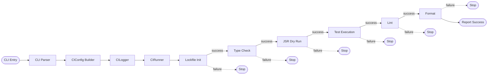
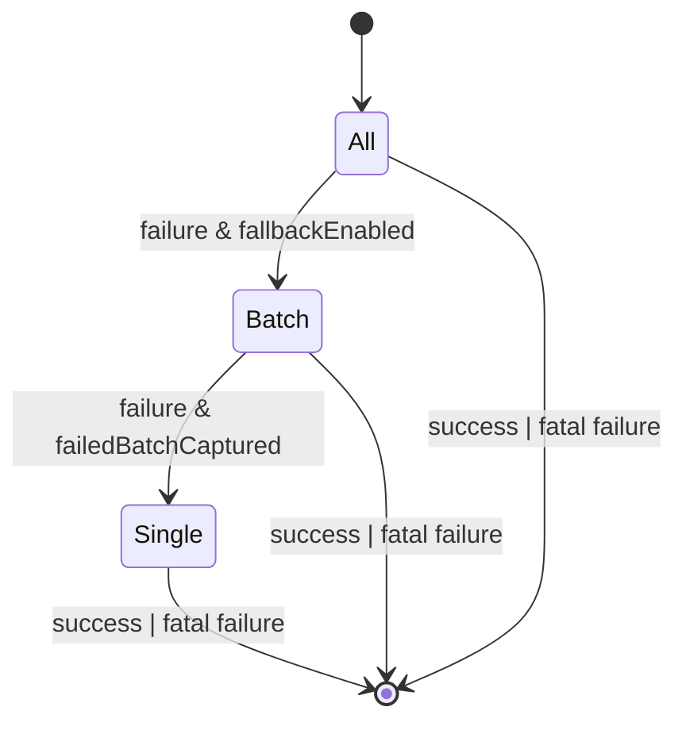
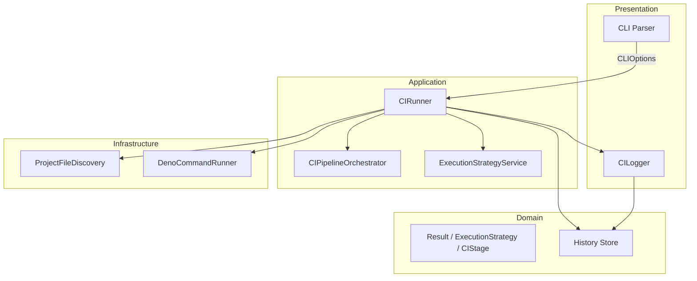

# Local CI Architecture

Local CIは「単純さがつくる機能美」と「段階的な完全性」を目的に設計される。Lockfile Init → Type → JSR → Test → Lint → Format を厳密な順序で実行し、失敗時は常に最小粒度 (single-file) まで切り詰めて one by one 修正を促す。

## 1. Pipeline Flow

- 各 Stage は完全に独立し、成功時のみ次 Stage へ遷移する。
- Lockfile Init は依存関係の解決と deno.lock の再生成を行い、後続ステージの安定性を保証する。
- 階層指定時は Type/Test/Lint/Format だけが対象となり、JSR は `skip` で即時完了扱いにする。

## 2. Execution & Fallback

- `ExecutionStrategy` は `All`, `Batch`, `Single` の有限集合で管理し、遷移表のみでフォールバックを許可する。
- `FailedBatchInfo` によって Batch → Single では失敗したバッチだけを対象に再実行し、ログには `batch # / fallback target` を必ず出力する。

## 3. Component Boundary

- Presentation 層は CLI 設定とログ表示に限定し、副作用は Application 層(Runner)がまとめて扱う。
- Application 層は `CIStage[]` をもとに処理ループを書くのみ。実際の命令やファイル収集は Infrastructure 層へ委譲する。
- Domain 層が Result 型や ExecutionStrategy を提供し、総状態を型で拘束する。

## 4. Stage Contract
| Stage | 対象 | 成功条件 | 失敗時の記録 |
| ----- | ------ | -------- | ------------ |
| Lockfile Init | deno.lock | `deno cache` exit code 0 | `FileSystemError` |
| Type Check | TypeScript ファイル (hierarchy 適用) | `deno check` exit code 0 | `TypeCheckError` と失敗ファイル集 |
| JSR Dry Run | プロジェクト全体 *(hierarchy時 skip)* | `deno publish --dry-run` 成功 | `JSRError` (fatal) |
| Test | 対象テストファイル | Strategy success (all/batch/single) | `TestFailure` + `FailedBatchInfo` |
| Lint | 全 TS ファイル (hierarchy) | `deno lint` success | `LintError` |
| Format | `deno fmt --check` | exit code 0 | `FormatError` |

- 各 StageResult は `success | failure | skipped` の3種類のみ。 `failure` のとき `CIError` を伴い Runner が即停止する。

## 5. Report & History
- 実行結果は History Store (`.ci-local/history.json`) に保存し、`ci status` や `ci retry` から参照する。
- ログメッセージは `[Stage/<name>]` `[Strategy/<mode>]` `[Fallback/<from>-><to>]` の定形形式で書き出し、解析と共有を容易にする。

この設計資料は docs/ 配下の唯一のアーキテクチャ仕様とし、実装は常にこの図とテーブルに整合させる。
